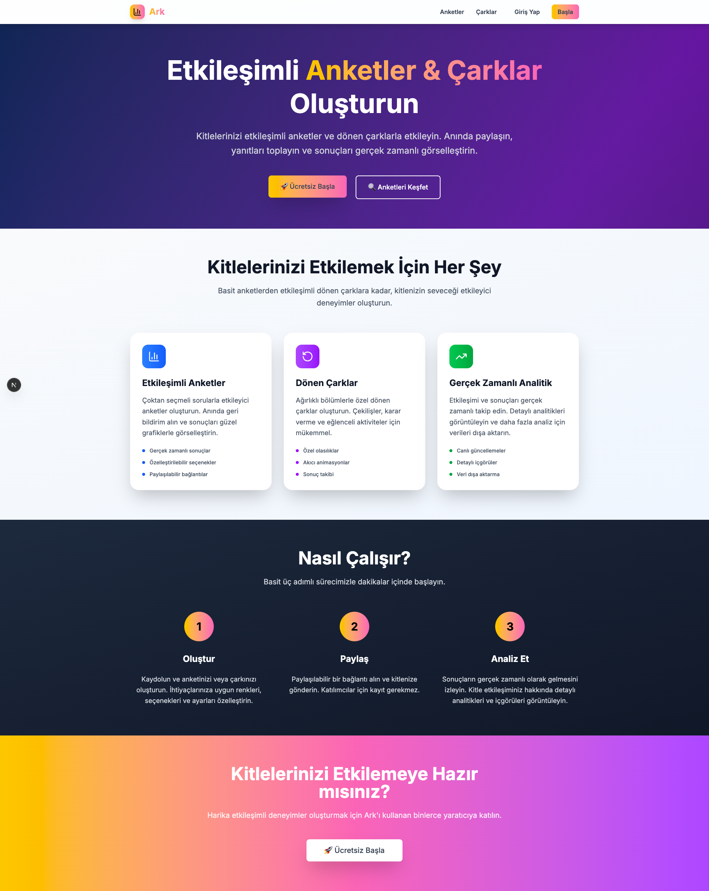
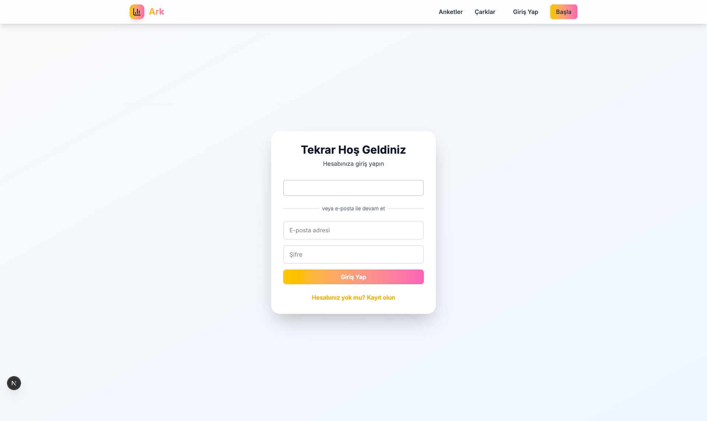
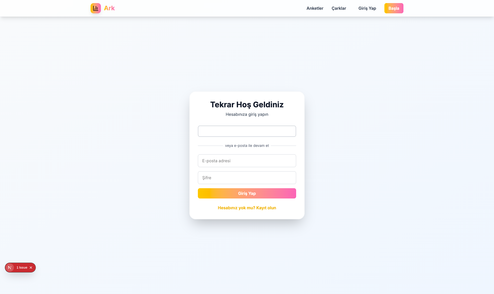
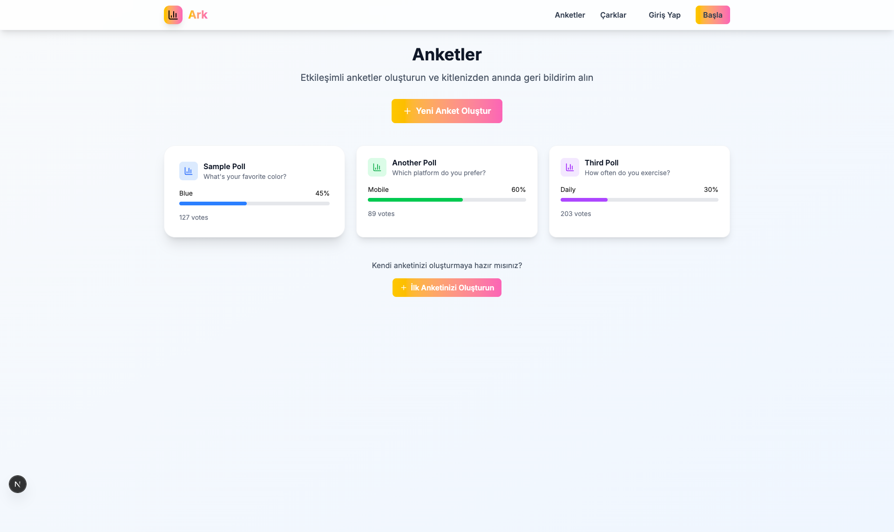
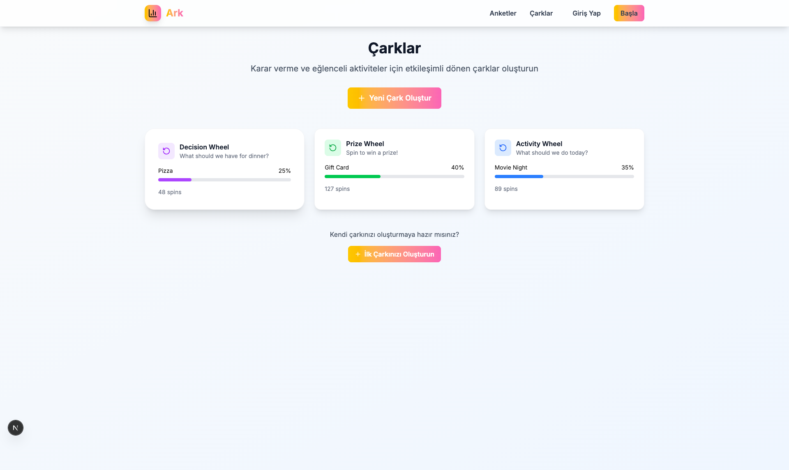

# 🎡 SpinPolls - Etkileşimli Anketler & Çarklar

Modern, kullanıcı dostu bir web uygulaması ile etkileşimli anketler ve dönen çarklar oluşturun. Next.js 14, Firebase ve TailwindCSS ile geliştirilmiştir.



## ✨ Özellikler

### 🗳️ Anketler
- Çoktan seçmeli sorularla etkileşimli anketler
- Gerçek zamanlı sonuçlar (Bar ve Pasta grafikleri)
- Paylaşılabilir bağlantılar
- Anonim oy verme desteği
- Özelleştirilebilir renkler ve seçenekler

### 🎡 Dönen Çarklar
- Ağırlıklı bölümlerle özel dönen çarklar
- Akıcı animasyonlar ve etkileşimli döndürme
- Gerçek zamanlı sonuç takibi
- Özelleştirilebilir renkler ve olasılıklar
- Paylaşılabilir bağlantılar

### 🔐 Kimlik Doğrulama
- Google ile giriş entegrasyonu
- Email/Şifre kimlik doğrulama
- Güvenli kullanıcı yönetimi
- Korumalı rotalar ve veriler

### 📊 Analitik
- Tüm sonuçlar için gerçek zamanlı güncellemeler
- Detaylı analitik ve içgörüler
- Dışa aktarılabilir veri görselleştirme
- İstatistiklerle kullanıcı paneli

## 🖼️ Ekran Görüntüleri

### Ana Sayfa

*Modern tasarım ve etkileyici hero section ile ana sayfa*

### Giriş Sayfası

*Google ve Email/Şifre ile giriş seçenekleri*

### Kullanıcı Paneli

*Anket ve çark yönetimi için kapsamlı panel*

### Anketler

*Mevcut anketleri keşfetme ve görüntüleme*

### Çarklar

*Mevcut çarkları keşfetme ve görüntüleme*

### Anket Oluşturma

*Kullanıcı dostu anket oluşturma formu*

### Çark Oluşturma

*Özelleştirilebilir çark oluşturma arayüzü*

## 🛠️ Teknoloji Stack

- **Frontend**: Next.js 14 (App Router), React, TypeScript
- **Styling**: TailwindCSS
- **Backend**: Firebase (Firestore, Authentication)
- **Grafikler**: Recharts
- **Animasyonlar**: Framer Motion
- **İkonlar**: Lucide React

## 🚀 Kurulum

### Gereksinimler

- Node.js 18+
- npm veya yarn
- Firebase projesi (Firestore ve Authentication etkin)

### Adımlar

1. **Repository'yi klonlayın:**
```bash
git clone https://github.com/k0d1r/spinpolls.git
cd spinpolls
```

2. **Bağımlılıkları yükleyin:**
```bash
npm install
```

3. **Firebase'i yapılandırın:**
   - [Firebase Console](https://console.firebase.google.com)'da proje oluşturun
   - Authentication'ı etkinleştirin (Google ve Email/Şifre sağlayıcıları)
   - Firestore Database'i etkinleştirin
   - Firebase config'inizi `src/lib/firebase.ts` dosyasına kopyalayın

4. **Firestore Security Rules'u dağıtın:**
   - `firestore.rules` dosyasındaki kuralları Firebase projenize kopyalayın
   - Firebase CLI veya Firebase Console kullanarak dağıtın

5. **Geliştirme sunucusunu başlatın:**
```bash
npm run dev
```

6. [http://localhost:3000](http://localhost:3000) adresini tarayıcınızda açın.

## 📁 Proje Yapısı

```
src/
├── app/                    # Next.js App Router sayfaları
│   ├── auth/              # Kimlik doğrulama sayfaları
│   ├── dashboard/         # Kullanıcı paneli
│   ├── polls/             # Anket sayfaları
│   └── wheels/            # Çark sayfaları
├── components/            # React bileşenleri
│   ├── auth/              # Kimlik doğrulama bileşenleri
│   ├── layout/            # Layout bileşenleri
│   ├── polls/             # Anket ile ilgili bileşenler
│   ├── ui/                # Yeniden kullanılabilir UI bileşenleri
│   └── wheels/            # Çark ile ilgili bileşenler
├── contexts/              # React context'leri
├── lib/                   # Yardımcı kütüphaneler
│   ├── auth.ts            # Kimlik doğrulama fonksiyonları
│   ├── database.ts        # Firestore işlemleri
│   └── firebase.ts        # Firebase yapılandırması
└── types/                 # TypeScript tip tanımları
```

## 🔧 Firebase Yapılandırması

### Kimlik Doğrulama Kurulumu
1. Google Sign-in sağlayıcısını etkinleştirin
2. Email/Şifre sağlayıcısını etkinleştirin
3. Yetkili domainleri yapılandırın

### Firestore Security Rules
Uygulama kapsamlı güvenlik kuralları içerir:
- Aktif anket ve çarklara genel okuma erişimi
- Yazma erişimini kimlik doğrulamalı kullanıcılarla sınırlar
- Kullanıcı verilerini ve oy gizliliğini korur
- Yetkisiz değişiklikleri önler

### Veritabanı Koleksiyonları
- `users` - Kullanıcı profilleri ve ayarları
- `polls` - Anket verileri ve seçenekleri
- `pollVotes` - Anonim oy kayıtları
- `wheels` - Çark verileri ve bölümleri
- `wheelSpins` - Anonim döndürme kayıtları

## 📖 Kullanım

### Anket Oluşturma
1. Hesabınıza giriş yapın
2. Panelden "Anket Oluştur"a gidin
3. Anket başlığı, açıklama ve seçenekleri ekleyin
4. Renkleri ve ayarları özelleştirin
5. Oluşturulan bağlantıyı paylaşın

### Çark Oluşturma
1. Hesabınıza giriş yapın
2. Panelden "Çark Oluştur"a gidin
3. Çark başlığı, açıklama ve bölümleri ekleyin
4. Her bölüm için özel olasılıklar belirleyin
5. Oluşturulan bağlantıyı paylaşın

### Sonuçları Görüntüleme
- Tüm anket ve çarklar için gerçek zamanlı güncellemeler
- Etkileşimli grafikler ve görselleştirmeler
- Detaylı analitik ve istatistikler
- Veri analizi için dışa aktarma yetenekleri

## 🚀 Dağıtım

### Vercel (Önerilen)
1. Kodunuzu GitHub'a push edin
2. Repository'nizi Vercel'e bağlayın
3. Firebase için ortam değişkenlerini ekleyin
4. Otomatik olarak dağıtın

### Diğer Platformlar
Uygulama Next.js destekleyen herhangi bir platforma dağıtılabilir:
- Netlify
- AWS Amplify
- Firebase Hosting
- Railway
- Render

## 🤝 Katkıda Bulunma

1. Repository'yi fork edin
2. Feature branch oluşturun
3. Değişikliklerinizi yapın
4. Uygunsa testler ekleyin
5. Pull request gönderin

## 📄 Lisans

Bu proje MIT Lisansı altında lisanslanmıştır - detaylar için LICENSE dosyasına bakın.

## 🆘 Destek

Destek ve sorular için:
- GitHub'da issue oluşturun
- Dokümantasyonu kontrol edin
- Firebase kurulum rehberini inceleyin

## 🗺️ Yol Haritası

- [ ] Gelişmiş anket türleri (sıralı seçim, onay oylaması)
- [ ] Özel temalar ve markalama
- [ ] Takım işbirliği özellikleri
- [ ] Üçüncü taraf entegrasyonları için API
- [ ] Mobil uygulama (React Native)
- [ ] Gelişmiş analitik ve raporlama
- [ ] Çoklu dil desteği
- [ ] PDF/CSV'ye dışa aktarma
- [ ] Anket/çark şablonları
- [ ] Zamanlanmış anketler ve çarklar

## 🌟 Öne Çıkan Özellikler

- **Türkçe Arayüz**: Tamamen Türkçe kullanıcı arayüzü
- **Responsive Tasarım**: Mobil ve desktop uyumlu
- **Modern UI/UX**: Apple.com tarzında minimalist tasarım
- **Gerçek Zamanlı**: Anlık güncellemeler ve sonuçlar
- **Güvenli**: Firebase güvenlik kuralları ile korumalı
- **Ölçeklenebilir**: Büyük kitleler için optimize edilmiş

---

**SpinPolls** ile kitlelerinizi etkileşimli anketler ve dönen çarklarla büyüleyin! 🎉